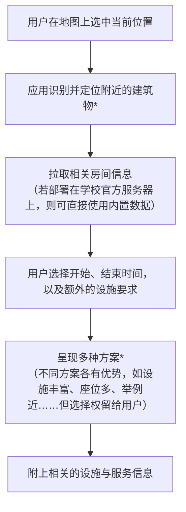
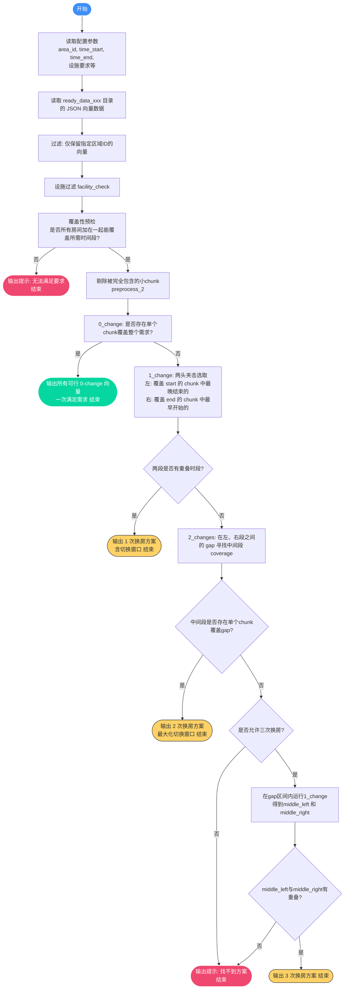

# Enjoy-your-seat

> [!IMPORTANT]
> **声明**
>
> 本仓库仅包含用于算法研究和客户端工具开发的 Python 脚本，**其本身不附带、不存储任何形式的专有数据或学校内部信息**。
>
> 所有的信息获取（如教室占用情况）均需用户在自己的计算机上、使用自己的合法凭证运行脚本来完成。生成的数据文件已被 `.gitignore` 明确排除，不会上传至本仓库。
>
> 本项目遵循 [MIT 许可协议](LICENSE)，按“原样”提供。开发者不对您如何使用这些脚本以及您获取的数据负任何责任。请确保您的使用行为符合您所在地区及学校的相关规定。

中文 | <a href="./README.md">English</a>

你是否曾在西交利物浦大学的校园里，为了找一个安静的自习座位而烦恼？尤其是在考试周，教学楼里人来人往，逐个扫码查看每个教室的课程表既费时又费力。

`Enjoy-your-seat` 正是为了解决这一痛点而生。它是一款为西浦学生设计的自习室查找工具，能够根据你的实时位置、期望的学习时间和特定设备需求，自动从学校的订场系统（MRBS）中筛选出最合适的教室，并为你规划出更换次数最少的学习方案。

核心解决场景：
* **临时起意，就近学习：** 刚下课，想在当前教学楼附近立刻找个空教室学习两小时？只需选择你所在的位置，程序会自动为你搜索附近的可用空间。

* **长期备考，无缝衔接：** 需要一个能从早上9点用到下午5点的学习空间？你无需再因为教室被预定而频繁搬动。本工具的核心算法会为你生成 **“零更换”或“最少更换”** 的智能方案，并清晰地标出更换教室间的 **“切换窗口期”** 。

* **特定需求，精准匹配：** 需要在线会议设备或86寸大屏进行小组讨论？通过设施筛选功能，你可以轻松找到满足特定需求的教室。

简单来说，Enjoy-your-seat 希望能把学生从“在校园里盲目寻找座位”的繁琐任务中解放出来，让你把宝贵的时间真正用在学习上。

## 目录

* [它如何工作？](#它如何工作)
    * [效果预览](#效果预览)
    * [大致逻辑](#大致逻辑)
    * [使用演示（概念图）](#使用演示概念图)
    * [程序如何根据位置给出备选教室？](#程序如何根据位置给出备选教室)
    * [教室方案是如何生成的？](#教室方案是如何生成的)
* [该算法的优缺点](#该算法的优缺点)
* [如何使用](#如何使用)
* [待办事项](#待办事项)

## 它如何工作？

### 效果预览

(箭头表示用户输入处)

### 大致逻辑

### 使用演示（概念图）

### 程序如何根据位置给出备选教室？

相关信息被硬编码在程序中。也就是说，一旦程序读取到用户输入的相对坐标，就会返回一组预设好的区域选择方案。

### 教室方案是如何生成的？

> 最初基于时间块的匹配逻辑已被弃用，你可以在 V0.0.0 版本中找到它。

简单来说，当某个时间段无法被一次性覆盖时，算法会采用一种“两头夹击-中间汇合”的递归逻辑：分别以开头和结尾为锚点，找到最靠近另一端点的时间块。如果仍然存在空白，那么再来一次。

## 该算法的优缺点

优点

  - 最少的教室更换次数
  - 最长的重叠时间（为用户提供更自由的更换教室时机）

缺点
  - 还没想好

## 如何使用

请参阅 [指南](quick-start-hans.md)

## 待办事项

  - [ ] 提供更细粒度的建议，不仅限于整个校园，例如可以精确到基础楼内部
  - [ ] 设施筛选功能
  - [ ] 创建区域ID (areaID) 与设施的映射表，以避免通过遍历和检查来完成用户的筛选要求。
