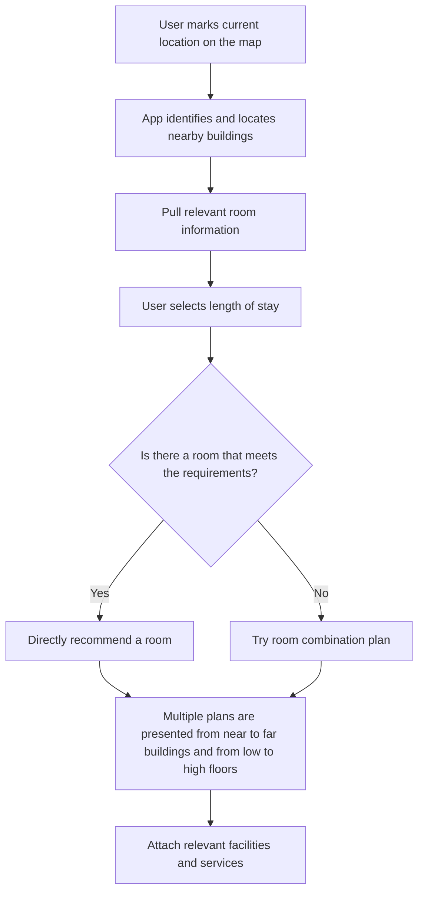

# Enjoy-your-seat
This app helps XJTLU students find empty seats near them for self-study.

The program will integrate the campus map and the [mrbs](https://mrbs.xjtlu.edu.cn/) website to select the nearest available classroom for users. Users only need to click on their location on the map, and the algorithm will recommend a suitable place for users.

## Introduction

<!-- Use this if your README is long to help users navigate. -->

### Rough logic

### Core Matchmaking Mechanics

> the initial time-based matching logic has been deprecated, you can find it in V0.0.0 release.

### Solver for Room combination
- least room change
- longest overlapping period (give users more freedom to decide when to switch)
- leaving early when the room availability is about to expire (optional)

## Effect Preview

