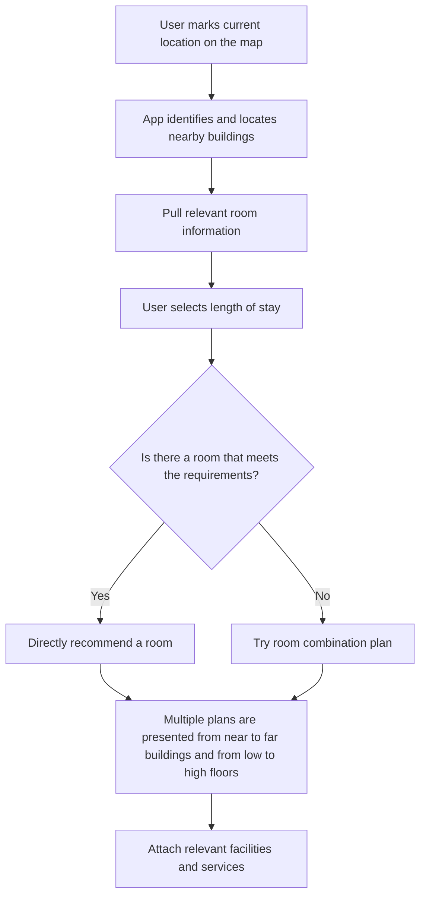

# Enjoy-your-seat
This app helps XJTLU students find empty seats near them for self-study.

The program will integrate the campus map and the [mrbs](https://mrbs.xjtlu.edu.cn/) website to select the nearest available classroom for users. Users only need to click on their location on the map, and the algorithm will recommend a suitable place for users.

## Table of Contents (Optional)

<!-- Use this if your README is long to help users navigate. -->





## Technologies Used (Optional)

<!-- List the main technologies, languages, and frameworks used in your project. -->

- [Technology 1] - [Version]
- [Technology 2] - [Version]
- [Technology 3] - [Version]

## Requirements

<!-- Specify any software or hardware prerequisites needed to run your project. -->

- [Requirement 1]
- [Requirement 2]

## Installation

<!-- Provide step-by-step instructions on how to install and set up the project locally. Include code snippets where helpful. -->

```bash
# Example installation command
npm install [your-package]
