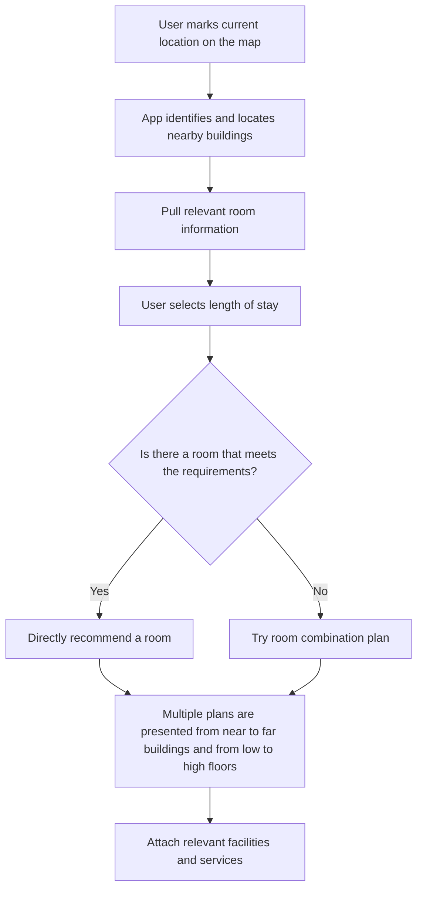

# Enjoy-your-seat
This app helps XJTLU students find empty seats near them for self-study.

The program will integrate the campus map and the [mrbs](https://mrbs.xjtlu.edu.cn/) website to select the nearest available classroom for users. Users only need to click on their location on the map, and the algorithm will recommend a suitable place for users.

## Introduction

<!-- Use this if your README is long to help users navigate. -->

### Rough logic



### Core Matchmaking Mechanics

```mermail
graph TD
        A[获取所有房间信息列表] --> B[将每个房间的可用时间分割为最小单位时间块];
        B --> C[合并具有相同可用房间集合的连续时间块];
        C --> D[生成最终的时间线: 一系列带着不同房间列表的时间块];
        E[读取用户的需求时间段] --> F[在时间线上寻找能覆盖需求的时间块组合];
        F --> G{找到可用组合?};
        G -- 是 --> H[为每个组合计算'差异度'以找到最优房间切换路径];
        H --> I[推荐'差异度'最小的方案给用户];
        G -- 否 --> J[告知用户无可用方案];
        I --> K[结束];
        J --> K[结束];
