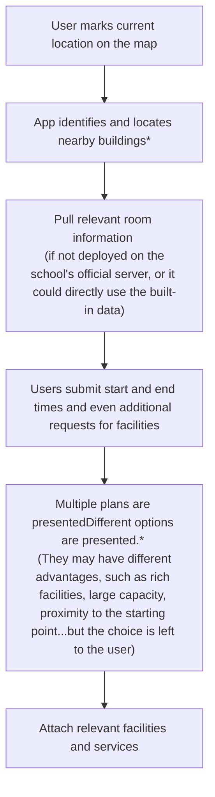
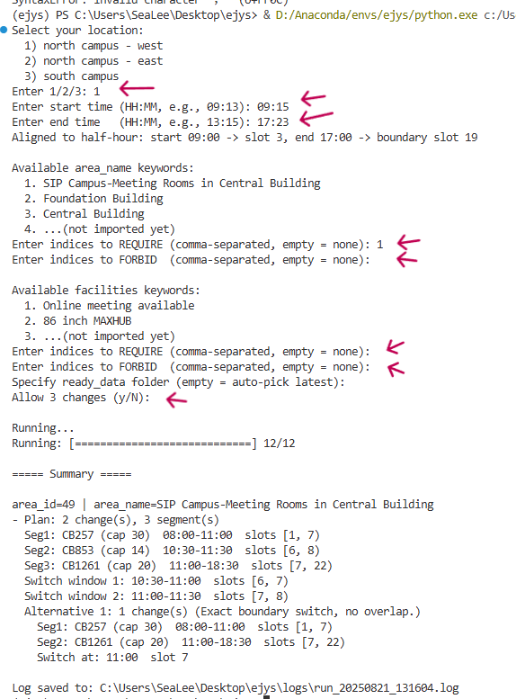
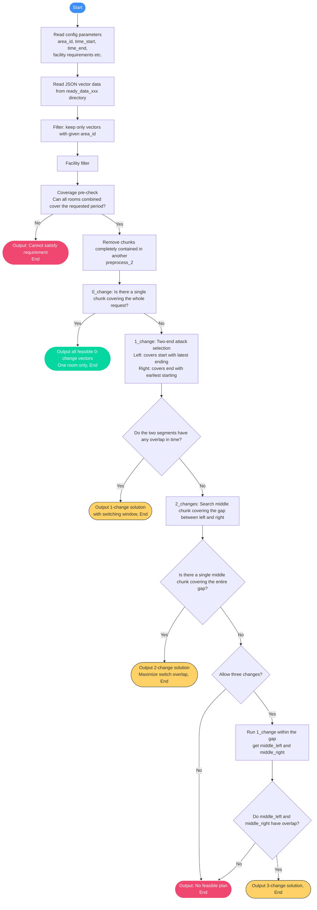

# Enjoy-your-seat

> [!IMPORTANT]
> **Important Notice**
>
> This repository contains only Python scripts intended for algorithmic research and client-side tool development. **It does not host, store, or distribute any proprietary data or internal information from the university.**
>
> All data acquisition (e.g., room availability) is performed locally on the user's machine, using their own legitimate credentials. The resulting data files are explicitly excluded from this repository via `.gitignore`.
>
> This project is provided "AS IS" under the [MIT License](LICENSE). The developer assumes no responsibility for how you use these scripts or for the data you acquire. Please ensure that your use of this tool complies with all relevant local and university regulations.

English | <a href="./README-hans.md">中文</a>

## Introduction

Tired of wandering the XJTLU campus looking for an empty classroom? `Enjoy-your-seat` is a smart study room finder that automates the search for you.

Based on your location and desired study time, it scans the university's [booking system](https://mrbs.xjtlu.edu.cn/) to find the best available rooms. Its core algorithm is designed to create optimized plans with **zero or minimal room changes**, perfect for long, uninterrupted study sessions.

* **Find a room right now, right here:** Instantly see available classrooms in nearby buildings.
* **Plan for the whole day:** Get a schedule with the fewest possible room changes.
* **Filter for your needs:** Find rooms with specific equipment like large screens or online meeting setups.

Stop searching and start studying. Let the app find your next seat.

## Table of Contents

* [How it works?](#how-it-works)
    * [Effect Preview](#effect-preview)
    * [Rough logic](#rough-logic)
    * [Usage Demonstration (concept)](#usage-demonstration-concept)
    * [How the app determines the appropriate area?](#how-the-app-determines-the-appropriate-area)
    * [How are room plans generated?](#how-are-room-plans-generated)
* [Advantages and disadvantages of this algorithm](#advantages-and-disadvantages-of-this-algorithm)
* [How to Use](#how-to-use)
* [Todo list](#todo-list)

### Effect Preview

## How it works

<!-- Use this if your README is long to help users navigate. -->

### Rough logic

### Usage Demonstration (concept)

(arrows indicate user input field)
### How the app determines the appropriate area？

The relevant information is hardcoded into the program, that is, once the relative coordinates input by the user are read, a set of pre-made area selection solutions will be returned.

### How are room plans generated?

> the initial time-based matching logic has been deprecated, you can find it in V0.0.0 release.

_Simply put, when a time period cannot be covered in one go, the algorithm employs a recursive "meet-in-the-middle" strategy: using the beginning and end as anchor points, it finds the time block closest to the other endpoint. If there's still a gap, it tries again._

## Advantages and disadvantages of this algorithm
advantages
- least room change
- longest overlapping period (give users more freedom to decide when to switch)

disadvantages
- ?

## How to Use

please see [this guide](quick-start.md)

## Todo list
- [ ] Provide more granular advice, not just on campus, such as within the Fundation Building
- [ ] facility filter
- [ ] Create a mapping table of areaID and facility to avoid the need to traverse and check to complete user filtering requirements.

